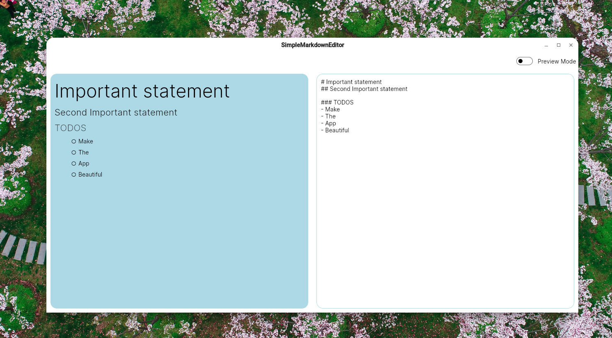

# Simple Markdown Text editor made with Avalonia !!

## Current look

### The app

### Demo
[showcase1.0.mp4](https://github.com/SmolPeaCat/MdEditor/assets/108297253/b02e1b15-9a47-466d-b46e-6a6a73a620a6)

## Roadmap
- Make the app look GOOD
- make the design responsive
- Enable downloading .md file
- ???
